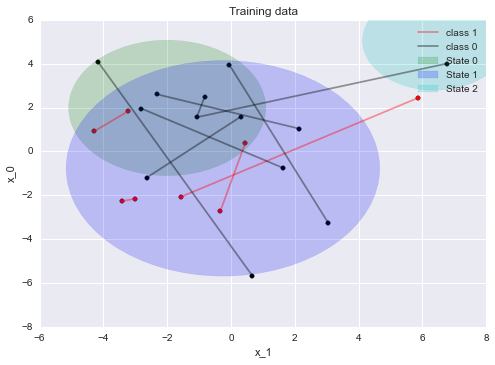

`pyHCRF`
==================

A hidden (state) conditional random field (HCRF) implementation written in Python and Cython.

This package aims to implement the HCRF model with a `sklearn` type interface. The model classifies sequences
according to a latent state sequence. This package provides methods to learn parameters from example sequences and
to score new sequences. See the [paper](http://people.csail.mit.edu/sybor/cvpr06_wang.pdf) by Wang et al and the
report *Conditional Random Fields for Noisy text normalisation* by Dirko Coetsee.

## Example

```python
X = [array([[ 1. , -0.82683403,  2.48881337],
            [ 1. , -1.07491808,  1.55848197],
            [ 1. ,  6.7814359 ,  4.01074595]]),
     array([[ 1. , -3.01165932, -2.15972362],
            [ 1. , -3.41449473, -2.2668825 ]]),
     array([[ 1. , -2.64921323, -1.20159641],
            [ 1. ,  0.31139394,  1.58841159]]),
     array([[ 1. ,  5.85226017,  2.43317499],
            [ 1. , -1.57598266, -2.07585778]]),
     array([[ 1. , -0.32999744, -2.70695361],
            [ 1. ,  0.44311988,  0.36400733]]),
     array([[ 1. , -0.05301562,  3.95424435],
            [ 1. ,  3.04540498, -3.25040276]]),
     array([[ 1. , -4.29117715,  0.9167861 ],
            [ 1. , -3.22775884,  1.83277224]]),
     array([[ 1. , -2.80856491,  1.95630489],
            [ 1. ,  1.62290542, -0.7457237 ]]),
     array([[ 1. , -2.32682366,  2.60844469],
            [ 1. ,  2.12320609,  1.04483217]]),
     array([[ 1. , -4.17616178,  4.09969658],
            [ 1. ,  0.67287935, -5.67652159]])]

y = [0, 1, 0, 1, 1, 0, 1, 0, 0, 0]
```



```python
from pyhcrf import Hcrf
from sklearn.metrics import confusion_matrix

model = Hcrf(num_states=3,
             l2_regularization=1.0,
             verbosity=10,
             random_seed=3,
             optimizer_kwargs={'maxfun':200})
model.fit(X, y)
pred = model.predict(X)
confusion_matrix(y, pred)
> array([[12,  0],
>        [ 0,  8]])
```

## States
Each state is numbered `0, 1, ..., num_states - 1`. The state machine starts in `state 0` and ends in `num_states - 1`.
Currently the state transitions are constrained so that, on each element in the input sequence,
 the state machine either stays in the current state or
advances to a state represented by the next number.
 This default can be changed by setting the `transitions` and corresponding
`transition_parameters` properties.

## Dependencies
`numpy`, `scipy` (for the LM-BFGS optimiser and `scipy.sparse`), and `cython`.

## Installation
Download/clone and run

```
python setup.py build_ext --inplace
python setup.py install
```
